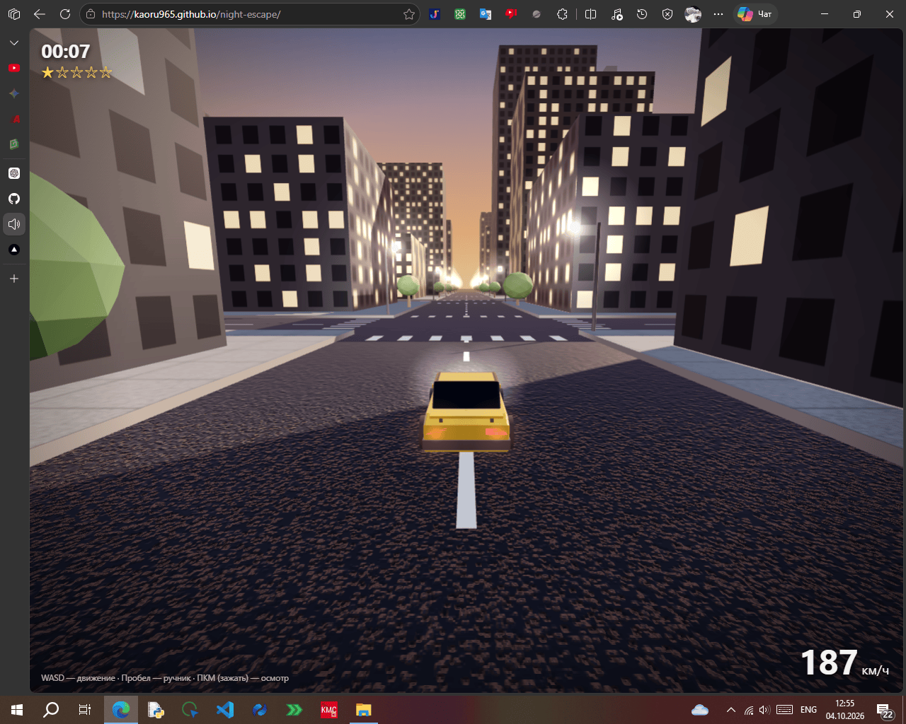

# [🌃](https://kaoru965.github.io/night-escape) Night Escape

**Night Escape** — это 3D браузерная игра на HTML5, CSS и JavaScript, созданная с использованием [Three.js](https://threejs.org/).

Ты управляешь машиной ночью и пытаешься как можно дольше уйти от преследующих тебя полицейских.
**Выйти из машины нельзя — только ехать дальше. 🚗💨**

[](https://kaoru965.github.io/night-escape)

## 🎮 Gameplay

Твоя задача проста:

> **Продержись как можно дольше и не дай полиции тебя догнать.**

Во время погони тебе придётся:

* 🚗 Управлять автомобилем
* 🚓 Уходить от полицейских машин
* 🏢 Избегать столкновений со зданиями и объектами
* 🌳 Объезжать деревья
* 💡 Ездить по ночному городу с фонарями
* ⏱️ Устанавливать новый рекорд по времени

## 🕹️ Управление

| Клавиша / действие    | Функция                 |
| --------------------- | ----------------------- |
| `W`                   | Ехать вперёд            |
| `A`                   | Повернуть влево         |
| `S`                   | Ехать назад / тормозить |
| `D`                   | Повернуть вправо        |
| `Space`               | Тормоз                  |
| `ПКМ + движение мыши` | Осмотр вокруг           |

> Управление может отличаться в зависимости от текущей версии игры.

## 🌐 Запуск

Игра работает прямо в современном веб-браузере.

### Играть онлайн

[▶️ PLAY NIGHT ESCAPE](https://kaoru965.github.io/night-escape/)

### Локальный запуск

Клонируй репозиторий:

```bash
git clone https://github.com/kaoru965/night-escape.git
cd nightescape
```

Затем открой `index.html` через локальный веб-сервер.

Например, можно использовать **Live Server** или любой другой статический HTTP-сервер.

## 📁 Структура проекта

```text
nightescape/
├── .ascode/
│   ├── launch.jsonc
│   └── settings.jsonc
│
├── src/
│   ├── favicon.svg
│   ├── game.js
│   ├── style.css
│   └── three.min.js
│
├── index.html
├── LICENSE
└── README.md
```

### `.ascode/`

Конфигурационные файлы проекта для **ASCode**.

### `src/game.js`

Основная игровая логика: машина, управление, полиция, столкновения, игровой мир и другие механики.

### `src/style.css`

Стили интерфейса и элементов игры.

### `src/three.min.js`

Локальная копия Three.js, используемая для создания 3D-сцены.

### `src/favicon.svg`

Иконка игры.

### `index.html`

Главная HTML-страница, запускающая игру.

## 🧰 Технологии

* **HTML5**
* **CSS3**
* **JavaScript**
* **Three.js**
* **WebGL**

Игра работает полностью в браузере и не требует отдельного игрового клиента.

## 📜 License

Проект распространяется под лицензией, указанной в [`LICENSE`](./LICENSE).

## ⭐ Contributing

Если хочешь предложить улучшение или исправление:

1. Сделай fork репозитория.
2. Создай отдельную ветку для изменений.
3. Внеси изменения.
4. Создай Pull Request.

Или просто открой Issue с описанием идеи или проблемы.

---

**Night Escape** — ночной город, одна машина и полиция позади.
**Сколько ты продержишься? 🚗🌃🚓**
